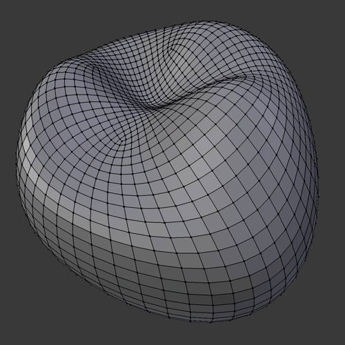

# BlenderNet

This repository is a collection of Python scripts for manipulating curve networks in Blender.

- `export-blendernet` : export curve network with normals traced on a mesh
- `select-extra-curves` : select curves which connect extraordinary vertices in a quad mesh

